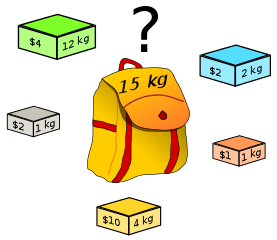

# Knapsack

Classical and state of the art algorithm implementations for the Knapsack Problem. Most algorithms are detailed in the "Knapsack Problem" book (Kellerer et al., 2004).



[image source](https://commons.wikimedia.org/wiki/File:Knapsack.svg)

This project uses Bazel https://bazel.build/

Compile:
```
bazel build --cxxopt='-std=c++14' --compilation_mode=opt -- //lib:main
```

Generate an instance:
```
bazel build --cxxopt='-std=c++14' --compilation_mode=opt -- //lib:generator_main
./bazel-bin/lib/generator_main -n 1000 -t sc -r 1000 -o ./ins.txt
```

Examples:
- `-n 100 -t u/wc/sc/isc/asc/ss/sw -r 1000`
- `-n 100 --spanner -t u/wc/sc/isc/asc/ss/sw -r 1000 -v 2 -m 10`
- `-n 100 -t mstr -r 1000 -k1 300 -k2 200 -d 6`
- `-n 100 -t pceil -r 1000 -d 3`
- `-n 100 -t circle -r 1000 -d 0.66`

Solve:
```
./bazel-bin/lib/main -a bellman_array_part -i ins.txt -o out.ini -c sol.txt -v
```

Instances can be visualized with gnuplot:
```
./bazel-bin/lib/generator_main -n 1000 -t sw -r 1000 -o ./ins.txt -p ./ins.plot
gnuplot
gnuplot> set yrange[0:]
gnuplot> set xrange[0:]
gnuplot> plot 'ins.plot' u 1:2
```

## Lower bounds

- O(n) Greedy `-a greedy` run Forward and Backward Greedy algorithms and return the best solution :heavy_check_mark:
- O(n log n) Greedy `-a greedynlogn`  run a Complete Greedy (continue filling the knapsack after the break item) and a Forward and Backward Greedy algorithm similar to the one described in "A fast algorithm for strongly correlated knapsack problems" (Pisinger, 1998), and return the best solution found :heavy_check_mark:

## Upper bounds

- Dantzig Upper bound `-a dantzig` :heavy_check_mark:
- Surrogate relaxation Upper bound `-a surrelax` :heavy_check_mark:

## Exact algorithms

### Classical algorithms

For Dynamic programming algorithms:
- option `-m` selects the type of memory used. Possible values are (if implemented) `array` or `list`. Lists are slower but eliminate dominated states and allow the use of Upper bounds.
- option `-r` selects the method used to retrieve the optimal solution. Possible values (if implemented) are
  - `none`: no solution retrieved, only the optimal value is returned
  - `all`: keep all states in memory and backtrack
  - `one`: keep only the last states in memory, retrieve the last item added and run the algorithm again to retrieve the complete optimal solution
  - `part`: keep a partial solution in each state and run the algorithm again while the global solution is not complete
  - `rec`: use the recursive scheme

Algorithms:
- Dynamic programming with Bellman recursion
  - Top-down (recursive): `-a bellmanrec_array` :heavy_check_mark:
  - Bottom-up (iterative), array: `-a bellman_array` :heavy_check_mark: `-a bellman_array_all` :heavy_check_mark: `-a bellman_array_one` :heavy_check_mark: `-a bellman_array_part` :heavy_check_mark: `-a bellman_array_rec` :heavy_check_mark:
  - Bottom-up (iterative), lists: `-a bellman_list` :heavy_check_mark: `-a bellman_list_sort` :heavy_check_mark: `-a bellman_list_rec` :heavy_check_mark:
  - Bottom-up (iterative), array, parallel: `-a bellmanpar_array` :heavy_check_mark:
- Dynamic programming by Profits `-a dpprofits_array` :heavy_check_mark: `-a dpprofits_array_all` :heavy_check_mark:
- Primal Branch-and-bound `-a bab` :heavy_check_mark: `-a bab_sort` :heavy_check_mark:

### State of the art algorithms

`combo` improvements are implemented:
- Option `-n`: use `combo` core
- Option `-g X`: `greedynlogn` will be executed at Xth node / if state number goes over X
- Option `-p X`: state pairing with items outside the core will be executed if state number goes over X
- Option `-s X`: surrogate relaxation and instance will be solved at Xth node / if state number goes over X

Algorithms:
- Balanced Dynamic programming `-a balknap -u t`. The list implementation requires a map. Therefore, its asymptotical complexity is slightly greater than the one with an array. However, the possiblity of combining the dynamic programming with bouding makes it more performant. Still, two versions are implemented. Options `-u` can be set to `b` (partial sorting, Dembo Upper bound with break item) or `t` (complete sorting, better Upper Bound) :heavy_check_mark: (with options `-g` :heavy_check_mark: `-s` :heavy_check_mark:)
- Primal-dual Dynamic programming (only with list) (`minknap`, `combo`) :heavy_check_mark: (with options `-n` :heavy_check_mark: `-g` :heavy_check_mark: `-p` :heavy_check_mark: `-s` :heavy_check_mark:)
- Primal-dual Branch-and-bound (`expknap`) `opt_expknap/main` :heavy_check_mark: (with options `-n` :heavy_check_mark: `-g` :heavy_check_mark: `-s`  :heavy_check_mark:)

## Results

- Processor: Intel® Core™ i5-8500 CPU @ 3.00GHz × 6
- Time limit: 3000s for each cell.

### Dynamic Programming: recursive vs iterative implementation

Except for very sparse instances (like SW), the iterative implementation is about 10 times faster.
- 
- 

### Dynamic Programming: cost of retrieving an optimal solution

The recursive scheme is clearly the fastest to retrieve an optimal solution.
It still requires 2 times more time than the implementation returning only the optimal value.
- 
- 
- 
- 

### When cache makes parallel algorithms slower

The parallel algorithm is implemented as follows: items are divided in two sets of same size. The all-capacities version of the knapsack problem is solved for both sets with the classical `bellman` recursion. Then, the optimal value is computed by merging the information from both arrays.
- 
- 

### State of the art algorithms

| Algorithm                               | Instances                                                                                                                                                          |
| --------------------------------------- | ------------------------------------------------------------------------------------------------------------------------------------------------------------------ |
| `expknap`                               | ,        ,                |
| `expknap -n -s 20000 -g 50000`          | ,  ,    |
| `minknap`                               | ,        ,                |
| `minknap -n -s 2000 -p 10000` (`combo`) | ,  ,    |
| `balknap`                               | ,        ,                |

Remarks:
- Spanner instances are among the worst cases of the `minknap` recursion, since many items of the break solution won't be in an optimal solution. It is interesting to note that the `bellman` recursion performs better . However, the worst case of the `bellman` recursion is worse than the worst case of the `minknap` recursion.
- These subset sum, strongly correlated and inverse strongly correlated instances are easy to solve since the upper bound happens to always be optimal.
- With `combo` optimizations, `expknap` is able to solve strongly correlated and inverse strongly correlated instances. It also solves more almost strongly correlated instances.
- Taking advantage of parallelization, this implementation of `combo` is able to solve all instances of the `difficult-large` dataset.

